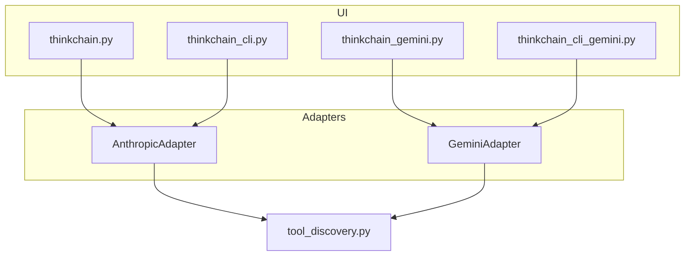

# Feature Implementation Plan: Gemini (google-genai) Parallel Execution Path

## Executive Summary
### Feature Overview
Add a second LLM engine to ThinkChain that uses **Google Gemini via the `google-genai` SDK**.  Users will be able to launch ThinkChain with a `--gemini` flag or environment variable and enjoy the same tool-aware conversational experience currently provided by Anthropic Claude.

### Implementation Approach
Introduce an **adapter layer** so UIs interact with an abstract `LLMAdapter` instead of Anthropic-specific calls.  Implement two concrete adapters (`AnthropicAdapter`, `GeminiAdapter`).  Fork the rich and CLI UIs into Gemini variants that delegate to `GeminiAdapter`.  Re-use existing tool discovery; convert each tool schema to `FunctionDeclaration` for Gemini requests and route `FunctionCall` parts back to the registry.

### Success Metrics
* End-to-end chat session with Gemini completes with streaming text and at least one automatic tool call.
* 95% unit-test coverage of new adapter layer.
* No regression in existing Anthropic path.

---

## 1. Post-Implementation Success Snapshot
- **New components**: `llm_adapter.py`, `GeminiAdapter`, `thinkchain_gemini.py`, `thinkchain_cli_gemini.py`
- **Modified components**: `run.py`, `tool_discovery.py`, `requirements.txt`, CI config
- **New capabilities**: Runtime choice of LLM, automatic Gemini function calling, Rich streaming without SSE.
- **Performance targets**: <500 ms average latency per streamed chunk with `gemini-1.5-flash`.

---

## 2. Architectural Design
### Design Summary

Key change: UIs talk to a pluggable adapter; tool subsystem remains unchanged.

### Key Design Decisions
1. **Adapter Layer** – isolates SDK differences.  *Trade-off*: small indirection vs long-term maintainability.
2. **Fork vs Conditional Logic** – Gemini gets its own entry points instead of `if mode==gemini` blocks everywhere.  Easier for juniors to navigate.
3. **Streaming Loop** – Use blocking iterator from `google-genai` rather than threading; simpler, aligns with current sync model.

### Interface Definitions
```python
# llm_adapter.py
class BaseAdapter(ABC):
    """Common interface for chat completions with tool support."""

    @abstractmethod
    def generate(self, messages: list[dict]) -> Iterable[LLMChunk]:
        """Yield chunks with .role, .text, .function_call optional."""
```

---

## 3. Work Breakdown Structure (WBS)
### Phase 1: Foundation (Est. 6 h)

#### Task FEAT-01: Add `llm_adapter.py`
*WHY*: Central abstraction allows multiple LLM back-ends.
Implementation Steps:
1. Define `BaseAdapter` ABC (see snippet above).
2. Move Anthropic-specific code from `thinkchain.py` into `AnthropicAdapter`.
Files: `llm_adapter.py`, `thinkchain.py`, `thinkchain_cli.py`.
Tests: Adapter interface mock test.
Acceptance: Anthropic path unchanged.

#### Task FEAT-02: Implement `GeminiAdapter`
Snippet:
```python
# gemini_adapter.py
import os, itertools, json
from google import genai
from google.genai.types import FunctionDeclaration, GenerationConfig
from llm_adapter import BaseAdapter, LLMChunk
from tool_discovery import get_function_declarations, execute_tool_sync

genai.configure(api_key=os.environ['GOOGLE_API_KEY'])

class GeminiAdapter(BaseAdapter):
    MODEL = os.getenv("GEMINI_MODEL", "gemini-1.5-flash")

    def _client(self):
        return genai.Client()

    def generate(self, messages):
        tools = get_function_declarations()
        stream = self._client().models.generate_content_stream(
            model=self.MODEL,
            contents=messages,
            tools=tools,
            generation_config=GenerationConfig(temperature=0.7, max_output_tokens=4096),
        )
        for chunk in stream:
            for part in chunk.candidates[0].content.parts:
                if hasattr(part, 'text'):
                    yield LLMChunk(role='assistant', text=part.text)
                elif hasattr(part, 'function_call'):
                    result = execute_tool_sync(part.function_call.name, part.function_call.args)
                    stream.send_tool_response(result)
```
Acceptance: Unit test mocks tool call round-trip.

#### Task FEAT-03: Fork Rich UI – `thinkchain_gemini.py`
Steps:
1. Copy `thinkchain.py` ➜ new file.
2. Replace import `from gemini_adapter import GeminiAdapter`.
3. Remove Anthropic-specific SSE; iterate over `GeminiAdapter.generate`.
Snippet:
```python
adapter = GeminiAdapter()
with Live(spinner) as live:
    for chunk in adapter.generate(chat_history):
        live.update(render_text(chunk.text))
```

#### Task FEAT-04: Fork CLI – `thinkchain_cli_gemini.py` (similar to FEAT-03).

### Phase 2: Core Features (Est. 7 h)

#### Task FEAT-05: Extend `tool_discovery.py` for Gemini declarations
Description: Convert each tool’s JSON schema to `FunctionDeclaration` returned by `get_function_declarations()`.
Snippet:
```python
from google.genai.types import FunctionDeclaration

def get_function_declarations():
    decls = []
    for tool in get_local_tools():
        decls.append(FunctionDeclaration(
            name=tool.name,
            description=tool.description,
            parameters=tool.input_schema,
        ))
    return decls
```

#### Task FEAT-06: Update `run.py` Launcher
Add `--gemini` flag & auto-detect by `GOOGLE_API_KEY`.

#### Task FEAT-07: Requirements & CI
Add `google-genai>=0.6.0` to `requirements.txt`; pin version in `pyproject.toml`; update CI matrix.

### Phase 3: Integration & Polish (Est. 5 h)
* FEAT-08: Rich spinner until first text chunk.
* FEAT-09: `/config` command to switch Gemini model at runtime.
* FEAT-10: Docs: README & `docs/gemini.md` setup guide.

### Phase 4: Testing (Est. 4 h)
* TEST-01: Adapter unit tests (mock `genai.Client`).
* TEST-02: Tool call round-trip integration test.
* TEST-03: CLI E2E test via `pexpect`.

---

## 4. Testing Strategy
* **Coverage goal**: ≥ 90% for adapter and new UIs.
* **Framework**: `pytest`, `pytest-asyncio`.
* Mock `genai.Client` with `unittest.mock`.
* Performance sample loads with 1-k token prompt.

---

## 5. Implementation Schedule
Milestone 1 – Foundation (FEAT-01 ➜ FEAT-04, 1 day)
Milestone 2 – Core Features (FEAT-05 ➜ FEAT-07, 1 day)
Milestone 3 – Integration & Tests (FEAT-08 ➜ TEST-03, 1 day)

---

## 6. Quality Gates
* Lint: `ruff` passes.
* All new code typed (`mypy --strict`).
* CI green on both Anthropic & Gemini test suites.

---

## 7. Risk Management
| Risk | P | I | Mitigation |
|------|---|---|-----------|
|SDK breaking change|M|M|Pin `google-genai` version; smoke test daily|
|Tool schema incompat|L|H|Add schema validation unit test|
|Cost overruns|M|M|Default to flash model, expose config|

---

## 8. Review & Roll-out
* PRs require 1 senior + 1 peer approval.
* Feature behind `--gemini` flag until stable.
* Rollback: fall back to Anthropic path; no DB migration.

---

## 9. Success Validation Checklist
- [ ] Gemini chat streams text with spinner feedback.
- [ ] Automatic tool calls function and returns result inline.
- [ ] All tests pass; coverage ≥ 90%.
- [ ] Documentation updated and reviewed.

---

## Appendix: Reference Code Cheatsheet
```python
# Minimal streaming call (latest SDK)
from google import genai
from google.genai.types import GenerationConfig

genai.configure(api_key="$GOOGLE_API_KEY")
client = genai.Client()
for chunk in client.models.generate_content_stream(
        model="gemini-1.5-flash",
        contents="Hello, world",
        generation_config=GenerationConfig(max_output_tokens=256)):
    print(chunk.text, end="", flush=True)
```
