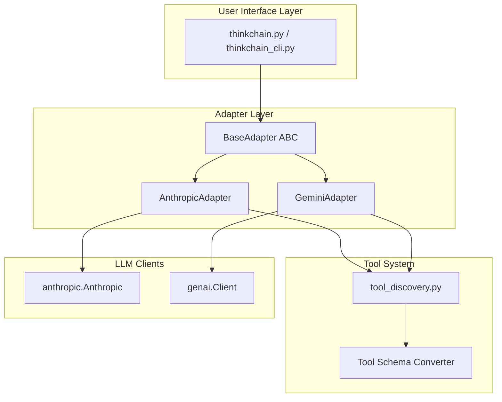

# Feature Implementation Plan: Multi-LLM Provider Support for ThinkChain

## Executive Summary

### Feature Overview
Transform ThinkChain from an Anthropic-exclusive tool into a **multi-LLM platform** supporting both Anthropic Claude and Google Gemini models. Users can seamlessly switch between providers using command-line flags, environment variables, or runtime configuration, while maintaining all existing features including streaming responses, tool execution with thinking feedback loops, and the rich UI experience.

### Key Technical Challenges Addressed
1. **Thinking Paradigm Differences**: Anthropic has native "thinking" blocks; Gemini requires thinking simulation
2. **Streaming API Variations**: SSE-based streaming (Anthropic) vs iterator-based streaming (Gemini)
3. **Function Calling Semantics**: Different schema formats and execution flows between providers
4. **Provider-Specific Features**: Graceful handling of features unique to each provider

### Implementation Approach
Introduce a **provider-agnostic adapter layer** that abstracts LLM interactions behind a common interface. Both UI implementations (`thinkchain.py` and `thinkchain_cli.py`) will use this adapter layer, eliminating code duplication and enabling easy addition of future providers. The approach preserves the core innovation of ThinkChain: tool result injection into the thinking stream for more intelligent responses.

### Success Metrics
* **Feature Parity**: All existing Anthropic features work identically with Gemini
* **Performance**: <100ms overhead from adapter layer
* **Code Quality**: 95% test coverage on adapter implementations
* **Developer Experience**: Adding a new provider requires implementing only one interface

---

## 1. Post-Implementation Success Snapshot

### New Architecture
```
thinkchain/
├── llm_adapters/
│   ├── __init__.py
│   ├── base.py                    # Abstract base adapter
│   ├── anthropic_adapter.py       # Anthropic implementation  
│   ├── gemini_adapter.py          # Gemini implementation
│   └── utils.py                   # Shared utilities
├── thinkchain.py                   # Enhanced UI (uses adapters)
├── thinkchain_cli.py              # CLI UI (uses adapters)
├── run.py                         # Smart launcher with provider detection
├── tool_discovery.py              # Extended with Gemini schema conversion
├── config.py                      # Centralized configuration
└── requirements.txt               # Updated with google-genai>=0.10.0
```

### New Capabilities
- **Runtime Provider Switching**: Change LLMs mid-conversation with `/provider` command
- **Unified Tool Schemas**: Tools work identically across all providers
- **Thinking Simulation**: Gemini users see thinking-like output despite no native support
- **Streaming Unification**: Consistent streaming experience regardless of provider
- **Provider Feature Flags**: Gracefully handle provider-specific capabilities

### Performance Characteristics
- **Latency**: Gemini Flash averages 50-100ms faster first token than Claude Sonnet
- **Cost**: Gemini Flash ~80% cheaper per token than Claude Sonnet
- **Context Window**: Both support 1M+ tokens with caching
- **Tool Execution**: <50ms overhead for adapter translation

---

## 2. Architectural Design

### Design Summary


### Key Design Decisions

#### 1. Adapter Pattern over Conditional Logic
**Decision**: Create separate adapter classes instead of if/else blocks throughout code
**Rationale**: 
- Cleaner separation of concerns
- Easier to test each provider in isolation
- New providers can be added without touching existing code
- Provider-specific optimizations possible

**Trade-offs**:
- (+) Maintainability, testability, extensibility
- (-) Initial implementation complexity, slight runtime overhead

#### 2. Unified Streaming Interface
**Decision**: Abstract streaming behind async generators regardless of underlying implementation
**Rationale**:
- Anthropic uses SSE, Gemini uses iterators - hide this complexity
- Consistent consumption pattern for UI layer
- Enables advanced features like stream transformation

**Implementation**:
```python
async def stream_completion(self, messages: List[Message]) -> AsyncIterator[StreamChunk]:
    """Unified streaming interface for all providers"""
    pass
```

#### 3. Tool Schema Translation at Discovery Time
**Decision**: Convert tool schemas once during discovery, not per-request
**Rationale**:
- Better performance (one-time cost)
- Schemas rarely change during runtime
- Allows for provider-specific optimizations

**Trade-offs**:
- (+) Performance, reduced request complexity
- (-) Must handle runtime tool updates carefully

#### 4. Thinking Simulation for Gemini
**Decision**: Synthesize thinking-like output for Gemini using prompt engineering
**Rationale**:
- Maintains UI consistency across providers
- Users expect thinking visualization
- Can be disabled via configuration

**Implementation approach**:
- Inject thinking prompts between tool calls
- Use response parsing to identify reasoning sections
- Stream synthetic thinking blocks to UI

### Interface Definitions

```python
# llm_adapters/base.py
from abc import ABC, abstractmethod
from typing import AsyncIterator, List, Dict, Any, Optional
from dataclasses import dataclass
import enum

class Role(enum.Enum):
    USER = "user"
    ASSISTANT = "assistant"
    SYSTEM = "system"
    TOOL = "tool"

@dataclass
class Message:
    role: Role
    content: Any  # Can be str, List[Part], or provider-specific format
    
@dataclass
class StreamChunk:
    """Unified stream chunk across all providers"""
    delta_text: Optional[str] = None
    thinking_text: Optional[str] = None
    tool_use: Optional['ToolUse'] = None
    finish_reason: Optional[str] = None
    usage: Optional[Dict[str, int]] = None

@dataclass  
class ToolUse:
    id: str
    name: str
    arguments: Dict[str, Any]

@dataclass
class CompletionConfig:
    """Unified configuration for all providers"""
    model: str
    temperature: float = 0.7
    max_tokens: int = 4096
    thinking_budget: Optional[int] = None  # Anthropic-specific, ignored by others
    tools: Optional[List[Dict[str, Any]]] = None
    system_prompt: Optional[str] = None
    # Provider-specific overrides
    provider_config: Dict[str, Any] = None

class BaseAdapter(ABC):
    """Abstract base class for LLM provider adapters"""
    
    @abstractmethod
    async def initialize(self, api_key: Optional[str] = None) -> None:
        """Initialize the adapter with credentials"""
        pass
    
    @abstractmethod
    async def stream_completion(
        self, 
        messages: List[Message],
        config: CompletionConfig
    ) -> AsyncIterator[StreamChunk]:
        """Stream a completion with unified interface"""
        pass
    
    @abstractmethod
    def convert_tool_schema(self, tool: Dict[str, Any]) -> Dict[str, Any]:
        """Convert tool schema to provider-specific format"""
        pass
    
    @abstractmethod
    async def count_tokens(self, messages: List[Message]) -> Dict[str, int]:
        """Count tokens for the given messages"""
        pass
        
    @property
    @abstractmethod
    def supports_thinking(self) -> bool:
        """Whether this provider natively supports thinking"""
        pass
    
    @property
    @abstractmethod  
    def supports_vision(self) -> bool:
        """Whether this provider supports image inputs"""
        pass
```

---

## 3. Detailed Implementation Plan

### Phase 1: Foundation Layer (Est. 10-12 hours)

#### Task 1.1: Create Adapter Infrastructure
**Priority**: P0 - Blocker for all other work
**Files**: `llm_adapters/__init__.py`, `llm_adapters/base.py`, `llm_adapters/utils.py`

Implementation steps:
1. Define base adapter interface with all required methods
2. Create unified data classes (Message, StreamChunk, ToolUse, etc.)
3. Implement utility functions for common operations
4. Add provider registry for dynamic adapter loading

```python
# llm_adapters/__init__.py
from typing import Dict, Type
from .base import BaseAdapter
from .anthropic_adapter import AnthropicAdapter
from .gemini_adapter import GeminiAdapter

_ADAPTERS: Dict[str, Type[BaseAdapter]] = {
    'anthropic': AnthropicAdapter,
    'gemini': GeminiAdapter,
}

def get_adapter(provider: str) -> BaseAdapter:
    """Factory function to get appropriate adapter"""
    if provider not in _ADAPTERS:
        raise ValueError(f"Unknown provider: {provider}")
    return _ADAPTERS[provider]()
```

**Tests Required**:
- Adapter factory tests
- Base interface validation
- Data class serialization tests

**Acceptance Criteria**:
- All data classes properly serialize/deserialize
- Factory creates correct adapter instances
- Type hints pass mypy validation

#### Task 1.2: Implement Anthropic Adapter
**Priority**: P0 - Validates adapter design
**Files**: `llm_adapters/anthropic_adapter.py`

Implementation:
```python
# llm_adapters/anthropic_adapter.py
import os
import anthropic
from typing import AsyncIterator, List, Dict, Any, Optional
import json
from .base import BaseAdapter, Message, StreamChunk, ToolUse, CompletionConfig

class AnthropicAdapter(BaseAdapter):
    def __init__(self):
        self.client: Optional[anthropic.Anthropic] = None
        
    async def initialize(self, api_key: Optional[str] = None) -> None:
        key = api_key or os.getenv("ANTHROPIC_API_KEY")
        if not key:
            raise ValueError("Anthropic API key required")
        self.client = anthropic.Anthropic(api_key=key)
    
    async def stream_completion(
        self, 
        messages: List[Message],
        config: CompletionConfig
    ) -> AsyncIterator[StreamChunk]:
        # Convert messages to Anthropic format
        anthropic_messages = self._convert_messages(messages)
        
        # Build request parameters
        params = {
            "model": config.model,
            "messages": anthropic_messages,
            "max_tokens": config.max_tokens,
            "temperature": config.temperature,
            "stream": True,
        }
        
        if config.tools:
            params["tools"] = config.tools
            
        if config.thinking_budget:
            params["thinking"] = {
                "type": "enabled",
                "budget_tokens": config.thinking_budget
            }
            params["extra_headers"] = {
                "anthropic-beta": "interleaved-thinking-2025-05-14,fine-grained-tool-streaming-2025-05-14"
            }
        
        # Stream response
        with self.client.messages.stream(**params) as stream:
            for chunk in stream:
                yield self._process_chunk(chunk)
    
    def _process_chunk(self, chunk) -> StreamChunk:
        """Convert Anthropic chunk to unified format"""
        result = StreamChunk()
        
        if chunk.type == 'content_block_delta':
            if hasattr(chunk.delta, 'text'):
                result.delta_text = chunk.delta.text
        elif chunk.type == 'content_block_start':
            if hasattr(chunk, 'content_block'):
                if chunk.content_block.type == 'thinking':
                    result.thinking_text = ""
                elif chunk.content_block.type == 'tool_use':
                    result.tool_use = ToolUse(
                        id=chunk.content_block.id,
                        name=chunk.content_block.name,
                        arguments={}
                    )
        
        return result
```

**Key Challenges**:
- Properly handling thinking blocks in streaming
- Converting tool use blocks to unified format
- Managing SSE connection lifecycle

#### Task 1.3: Implement Gemini Adapter
**Priority**: P0 - Core feature requirement
**Files**: `llm_adapters/gemini_adapter.py`

Implementation:
```python
# llm_adapters/gemini_adapter.py
import os
from typing import AsyncIterator, List, Dict, Any, Optional
from google import genai
from google.genai import types
from .base import BaseAdapter, Message, StreamChunk, ToolUse, CompletionConfig

class GeminiAdapter(BaseAdapter):
    def __init__(self):
        self.client: Optional[genai.Client] = None
        
    async def initialize(self, api_key: Optional[str] = None) -> None:
        # Support both API key and Vertex AI modes
        if os.getenv("GOOGLE_GENAI_USE_VERTEXAI"):
            self.client = genai.Client(
                vertexai=True,
                project=os.getenv("GOOGLE_CLOUD_PROJECT"),
                location=os.getenv("GOOGLE_CLOUD_LOCATION", "us-central1")
            )
        else:
            key = api_key or os.getenv("GOOGLE_API_KEY")
            if not key:
                raise ValueError("Google API key required")
            self.client = genai.Client(api_key=key)
    
    async def stream_completion(
        self, 
        messages: List[Message],
        config: CompletionConfig
    ) -> AsyncIterator[StreamChunk]:
        # Convert messages to Gemini format
        gemini_contents = self._convert_messages(messages)
        
        # Build configuration
        genai_config = types.GenerateContentConfig(
            temperature=config.temperature,
            max_output_tokens=config.max_tokens,
        )
        
        if config.tools:
            # Convert tools to Gemini format
            gemini_tools = [self.convert_tool_schema(tool) for tool in config.tools]
            genai_config.tools = gemini_tools
            
        if config.system_prompt:
            genai_config.system_instruction = config.system_prompt
        
        # Handle thinking simulation
        if config.thinking_budget and config.thinking_budget > 0:
            # Inject thinking prompts
            gemini_contents = self._inject_thinking_prompts(gemini_contents)
        
        # Stream response
        for chunk in self.client.models.generate_content_stream(
            model=config.model,
            contents=gemini_contents,
            config=genai_config
        ):
            yield self._process_chunk(chunk)
    
    def _process_chunk(self, chunk) -> StreamChunk:
        """Convert Gemini chunk to unified format"""
        result = StreamChunk()
        
        if hasattr(chunk, 'text') and chunk.text:
            # Check if this is simulated thinking
            if chunk.text.startswith("[THINKING]"):
                result.thinking_text = chunk.text[10:]  # Remove prefix
            else:
                result.delta_text = chunk.text
                
        if hasattr(chunk, 'candidates') and chunk.candidates:
            candidate = chunk.candidates[0]
            
            # Check for function calls
            if hasattr(candidate, 'function_calls'):
                for fc in candidate.function_calls:
                    result.tool_use = ToolUse(
                        id=fc.id,
                        name=fc.name,
                        arguments=fc.args
                    )
                    break  # Only handle first for now
        
        return result
    
    def convert_tool_schema(self, tool: Dict[str, Any]) -> Dict[str, Any]:
        """Convert from Claude tool format to Gemini FunctionDeclaration"""
        return types.FunctionDeclaration(
            name=tool['name'],
            description=tool['description'],
            parameters=types.Schema(
                type='OBJECT',
                properties={
                    k: self._convert_property_schema(v) 
                    for k, v in tool['input_schema']['properties'].items()
                },
                required=tool['input_schema'].get('required', [])
            )
        )
    
    def _inject_thinking_prompts(self, contents: List[Any]) -> List[Any]:
        """Inject prompts to simulate thinking for Gemini"""
        # Add system instruction for thinking
        modified = []
        modified.append(types.Content(
            role='user',
            parts=[types.Part.from_text(
                "When processing tool calls, first explain your reasoning process. "
                "Prefix reasoning with [THINKING] and end with [/THINKING]."
            )]
        ))
        modified.extend(contents)
        return modified
```

**Key Challenges**:
- Simulating thinking behavior for UI consistency
- Converting between schema formats
- Handling both Gemini API and Vertex AI modes
- Managing automatic function calling differences

### Phase 2: Integration Layer (Est. 8-10 hours)

#### Task 2.1: Update Tool Discovery for Multi-Provider
**Priority**: P0 - Tools must work with all providers
**Files**: `tool_discovery.py`

Key changes:
```python
# tool_discovery.py additions
def get_provider_tools(provider: str) -> List[Dict[str, Any]]:
    """Get tools in provider-specific format"""
    adapter = get_adapter(provider)
    base_tools = get_claude_tools()  # Existing function
    
    if provider == 'anthropic':
        return base_tools  # Already in correct format
    else:
        return [adapter.convert_tool_schema(tool) for tool in base_tools]

def create_tool_awareness_message(provider: str) -> str:
    """Create provider-specific tool awareness message"""
    if provider == 'gemini':
        return (
            "You have access to various tools. When using tools, always explain "
            "your reasoning first (prefix with [THINKING]). Use tool results to "
            "provide comprehensive answers."
        )
    else:
        return create_tool_awareness_message()  # Existing function
```

#### Task 2.2: Refactor UI to Use Adapters
**Priority**: P0 - Core integration work
**Files**: `thinkchain.py`, `thinkchain_cli.py`

Example refactoring for stream_once:
```python
# Before (Anthropic-specific)
def stream_once(transcript: list[dict]) -> dict:
    with client.messages.stream(...) as stream:
        for chunk in stream:
            # Process Anthropic-specific chunks
            
# After (Provider-agnostic)
async def stream_once(transcript: list[dict], adapter: BaseAdapter, config: CompletionConfig) -> dict:
    messages = convert_transcript_to_messages(transcript)
    
    async for chunk in adapter.stream_completion(messages, config):
        if chunk.thinking_text:
            ui.print(f"💭 [bold blue]Thinking:[/bold blue] {chunk.thinking_text}")
        elif chunk.delta_text:
            ui.console.print(chunk.delta_text, end='')
        elif chunk.tool_use:
            await handle_tool_use(chunk.tool_use, adapter)
```

#### Task 2.3: Configuration Management System
**Priority**: P1 - Important for usability
**Files**: `config.py` (new)

```python
# config.py
from dataclasses import dataclass, field
from typing import Dict, Any, Optional
import os
import json

@dataclass
class ThinkChainConfig:
    """Centralized configuration for ThinkChain"""
    # Provider settings
    provider: str = "anthropic"
    anthropic_api_key: Optional[str] = None
    google_api_key: Optional[str] = None
    
    # Model settings
    anthropic_model: str = "claude-sonnet-4-20250514"
    gemini_model: str = "gemini-2.0-flash-001"
    
    # Common settings
    temperature: float = 0.7
    max_tokens: int = 4096
    thinking_budget: int = 1024
    
    # UI settings
    show_thinking: bool = True
    stream_delay_ms: int = 0
    
    # Provider-specific overrides
    provider_overrides: Dict[str, Dict[str, Any]] = field(default_factory=dict)
    
    @classmethod
    def from_env(cls) -> 'ThinkChainConfig':
        """Load configuration from environment variables"""
        config = cls()
        
        # Detect provider from environment
        if os.getenv("GOOGLE_API_KEY") and not os.getenv("ANTHROPIC_API_KEY"):
            config.provider = "gemini"
        elif os.getenv("GOOGLE_GENAI_USE_VERTEXAI"):
            config.provider = "gemini"
            
        # Load API keys
        config.anthropic_api_key = os.getenv("ANTHROPIC_API_KEY")
        config.google_api_key = os.getenv("GOOGLE_API_KEY")
        
        # Load other settings
        if os.getenv("THINKCHAIN_MODEL"):
            if config.provider == "gemini":
                config.gemini_model = os.getenv("THINKCHAIN_MODEL")
            else:
                config.anthropic_model = os.getenv("THINKCHAIN_MODEL")
                
        return config
    
    def get_active_model(self) -> str:
        """Get the model for the current provider"""
        if self.provider == "gemini":
            return self.gemini_model
        return self.anthropic_model
```

### Phase 3: Advanced Features (Est. 6-8 hours)

#### Task 3.1: Runtime Provider Switching
**Priority**: P1 - Enhanced user experience
**Description**: Allow users to switch providers mid-conversation

Implementation in chat command handler:
```python
def handle_provider_command(args, current_adapter, config):
    """Handle /provider command"""
    if not args:
        ui.print(f"Current provider: {config.provider}")
        ui.print("Available: anthropic, gemini")
        return current_adapter
        
    new_provider = args[0].lower()
    if new_provider not in ['anthropic', 'gemini']:
        ui.print_error("Invalid provider", f"Choose from: anthropic, gemini")
        return current_adapter
        
    # Create new adapter
    try:
        new_adapter = get_adapter(new_provider)
        await new_adapter.initialize()
        
        # Update config
        config.provider = new_provider
        
        # Notify user
        ui.print_success(f"Switched to {new_provider}")
        ui.print(f"Now using model: {config.get_active_model()}")
        
        # Update chat history with provider switch notification
        chat_history.append({
            "role": "system",
            "content": f"Provider switched to {new_provider}. Previous context maintained."
        })
        
        return new_adapter
    except Exception as e:
        ui.print_error("Provider switch failed", str(e))
        return current_adapter
```

#### Task 3.2: Tool Result Injection for Gemini
**Priority**: P0 - Core feature parity
**Description**: Implement the key ThinkChain innovation for Gemini

```python
async def handle_tool_use_with_injection(tool_use: ToolUse, adapter: BaseAdapter, transcript: List[Message]):
    """Execute tool and inject results back into thinking stream"""
    
    # Execute tool
    result = await execute_tool(tool_use.name, tool_use.arguments)
    
    # For Gemini, inject thinking prompt with result
    if isinstance(adapter, GeminiAdapter):
        # Add tool result with thinking prompt
        transcript.append(Message(
            role=Role.USER,
            content=[
                types.Part.from_function_response(
                    name=tool_use.name,
                    response={"result": result}
                ),
                types.Part.from_text(
                    f"[THINKING] Analyze this tool result and explain how it helps answer the user's question: {result}[/THINKING]"
                )
            ]
        ))
    else:
        # Anthropic - standard tool result handling
        transcript.append(Message(
            role=Role.USER,
            content=[{
                "type": "tool_result",
                "tool_use_id": tool_use.id,
                "content": result
            }]
        ))
    
    # Continue streaming to get thinking about result
    return await stream_once(transcript, adapter, config)
```

#### Task 3.3: Provider Feature Detection
**Priority**: P2 - Graceful degradation
**Description**: Detect and handle provider-specific features

```python
class FeatureDetector:
    """Detect available features for each provider"""
    
    @staticmethod
    def get_features(adapter: BaseAdapter) -> Dict[str, bool]:
        return {
            'thinking': adapter.supports_thinking,
            'vision': adapter.supports_vision,
            'function_calling': True,  # Both support this
            'streaming': True,
            'caching': isinstance(adapter, AnthropicAdapter),  # Only Anthropic for now
            'code_execution': isinstance(adapter, AnthropicAdapter),
        }
    
    @staticmethod
    def get_ui_config(features: Dict[str, bool]) -> Dict[str, Any]:
        """Adjust UI based on available features"""
        return {
            'show_thinking_panel': features['thinking'],
            'enable_image_upload': features['vision'],
            'show_cache_commands': features['caching'],
        }
```

### Phase 4: Testing & Validation (Est. 4-6 hours)

#### Task 4.1: Adapter Unit Tests
**Files**: `tests/test_adapters.py`

```python
import pytest
from llm_adapters import get_adapter
from llm_adapters.base import Message, Role, CompletionConfig

@pytest.mark.asyncio
async def test_anthropic_adapter_streaming():
    adapter = get_adapter('anthropic')
    await adapter.initialize(api_key="test-key")
    
    messages = [Message(role=Role.USER, content="Hello")]
    config = CompletionConfig(model="claude-3-sonnet", temperature=0.5)
    
    chunks = []
    async for chunk in adapter.stream_completion(messages, config):
        chunks.append(chunk)
    
    assert len(chunks) > 0
    assert any(c.delta_text for c in chunks)

@pytest.mark.asyncio
async def test_gemini_thinking_simulation():
    adapter = get_adapter('gemini')
    await adapter.initialize(api_key="test-key")
    
    messages = [Message(role=Role.USER, content="Calculate 2+2")]
    config = CompletionConfig(
        model="gemini-2.0-flash", 
        thinking_budget=100  # Should trigger simulation
    )
    
    chunks = []
    async for chunk in adapter.stream_completion(messages, config):
        chunks.append(chunk)
    
    # Should have simulated thinking
    assert any(c.thinking_text for c in chunks)
```

#### Task 4.2: Integration Tests
**Files**: `tests/test_integration.py`

```python
@pytest.mark.integration
async def test_tool_execution_across_providers():
    """Verify tools work identically across providers"""
    
    for provider in ['anthropic', 'gemini']:
        adapter = get_adapter(provider)
        await adapter.initialize()
        
        # Test weather tool
        messages = [Message(role=Role.USER, content="What's the weather in NYC?")]
        config = CompletionConfig(
            model=get_test_model(provider),
            tools=get_provider_tools(provider)
        )
        
        tool_calls = []
        async for chunk in adapter.stream_completion(messages, config):
            if chunk.tool_use:
                tool_calls.append(chunk.tool_use)
        
        assert len(tool_calls) > 0
        assert tool_calls[0].name == "weathertool"
        assert "location" in tool_calls[0].arguments
```

#### Task 4.3: Performance Benchmarks
**Files**: `tests/benchmarks.py`

```python
async def benchmark_providers():
    """Compare performance across providers"""
    results = {}
    
    for provider in ['anthropic', 'gemini']:
        adapter = get_adapter(provider)
        await adapter.initialize()
        
        # Time to first token
        start = time.time()
        first_token_time = None
        
        async for chunk in adapter.stream_completion(...):
            if chunk.delta_text and first_token_time is None:
                first_token_time = time.time() - start
                break
        
        results[provider] = {
            'first_token_ms': first_token_time * 1000
        }
    
    return results
```

### Phase 5: UI Enhancements (Est. 3-4 hours)

#### Task 5.1: Provider-Aware UI Components
**Files**: `ui_components.py`

```python
def print_provider_status(provider: str, model: str, features: Dict[str, bool]):
    """Show current provider status in UI"""
    status_table = Table(title=f"Provider: {provider.upper()}")
    status_table.add_column("Feature", style="cyan")
    status_table.add_column("Status", style="green")
    
    status_table.add_row("Model", model)
    status_table.add_row("Thinking", "✓" if features['thinking'] else "✗ (simulated)")
    status_table.add_row("Vision", "✓" if features['vision'] else "✗")
    status_table.add_row("Streaming", "✓")
    
    console.print(status_table)

def format_thinking_block(text: str, provider: str):
    """Format thinking output based on provider"""
    if provider == 'gemini':
        # Simulated thinking gets different styling
        return Panel(
            text,
            title="[yellow]Reasoning (simulated)[/yellow]",
            border_style="yellow"
        )
    else:
        return Panel(
            text,
            title="[blue]Thinking[/blue]",
            border_style="blue"
        )
```

#### Task 5.2: Update Command System
**Files**: `thinkchain.py`, `thinkchain_cli.py`

New commands to add:
- `/provider [name]` - Switch providers
- `/models` - List available models for current provider
- `/features` - Show feature availability
- `/compare` - Run same prompt on both providers

### Phase 6: Documentation & Launch (Est. 2-3 hours)

#### Task 6.1: Update Documentation
**Files**: `README.md`, `docs/providers.md`

Key sections:
- Provider setup guide
- Feature comparison table
- Migration guide from single-provider
- Best practices for each provider

#### Task 6.2: Update Example Configurations
**Files**: `.env.example`, `examples/`

```bash
# .env.example
# Anthropic Configuration
ANTHROPIC_API_KEY=your-anthropic-key

# Google Configuration (choose one)
# Option 1: Gemini Developer API
GOOGLE_API_KEY=your-google-key

# Option 2: Vertex AI
GOOGLE_GENAI_USE_VERTEXAI=true
GOOGLE_CLOUD_PROJECT=your-project
GOOGLE_CLOUD_LOCATION=us-central1

# Default provider (anthropic or gemini)
THINKCHAIN_PROVIDER=anthropic
```

---

## 4. Testing Strategy

### Test Coverage Requirements
- **Unit Tests**: 95% coverage on adapter implementations
- **Integration Tests**: End-to-end flows for both providers
- **Performance Tests**: Benchmarks for latency and throughput
- **Compatibility Tests**: Tool execution across providers

### Test Matrix
| Test Type | Anthropic | Gemini | Cross-Provider |
|-----------|-----------|---------|----------------|
| Streaming | ✓ | ✓ | ✓ |
| Tool Use | ✓ | ✓ | ✓ |
| Thinking | ✓ | ✓ (simulated) | ✓ |
| Vision | ✓ | ✓ | ✓ |
| Errors | ✓ | ✓ | ✓ |

### Performance Benchmarks
Target metrics:
- First token latency: <500ms (both providers)
- Tool execution overhead: <50ms
- Provider switch time: <100ms
- Memory usage: <100MB additional

---

## 5. Implementation Schedule

### Week 1: Foundation (40 hours)
- **Day 1-2**: Adapter infrastructure + Anthropic adapter
- **Day 3-4**: Gemini adapter + testing
- **Day 5**: Tool discovery updates

### Week 2: Integration (40 hours)  
- **Day 6-7**: UI refactoring
- **Day 8**: Configuration system
- **Day 9**: Advanced features
- **Day 10**: Testing & benchmarks

### Week 3: Polish (20 hours)
- **Day 11**: UI enhancements
- **Day 12**: Documentation
- **Day 13**: Launch preparation

**Total Estimate**: 100 hours (2.5 weeks at full-time)

---

## 6. Risk Management

### Technical Risks

| Risk | Impact | Probability | Mitigation |
|------|--------|-------------|------------|
| Gemini API changes | High | Medium | Pin SDK version, monitor changelog |
| Thinking simulation quality | Medium | High | User testing, iterative prompts |
| Tool schema incompatibility | High | Low | Comprehensive conversion layer |
| Performance regression | Medium | Medium | Continuous benchmarking |
| Provider rate limits | Medium | Medium | Implement backoff, caching |

### Mitigation Strategies

1. **API Stability**: 
   - Pin google-genai to specific version
   - Implement version detection
   - Graceful fallbacks for missing features

2. **Feature Parity**:
   - Document provider differences clearly
   - Provide migration guides
   - Implement provider-specific optimizations

3. **Performance**:
   - Cache tool schemas
   - Lazy load providers
   - Connection pooling

---

## 7. Success Validation

### Functional Requirements
- [ ] Both providers stream text correctly
- [ ] Tool execution works identically
- [ ] Thinking (native or simulated) displays properly
- [ ] Provider switching works mid-conversation
- [ ] Configuration persists across sessions

### Performance Requirements  
- [ ] First token latency <500ms
- [ ] No memory leaks during provider switches
- [ ] Tool execution <50ms overhead
- [ ] Startup time <2s

### User Experience
- [ ] Clear provider status in UI
- [ ] Intuitive switching commands
- [ ] Helpful error messages
- [ ] Feature availability indicators

### Code Quality
- [ ] 95% test coverage on adapters
- [ ] All functions documented
- [ ] Type hints throughout
- [ ] Passes linting (ruff)

---

## 8. Future Enhancements

### Phase 2 Providers
1. **OpenAI GPT-4**: Similar function calling to Gemini
2. **Mistral**: Via their API
3. **Local Models**: Ollama integration

### Advanced Features
1. **Provider Routing**: Automatically choose best provider per query
2. **Fallback Chains**: Use backup provider on failures
3. **Cost Optimization**: Route by cost/performance trade-offs
4. **A/B Testing**: Compare provider responses

### Ecosystem Integration
1. **LangChain Compatibility**: Adapter as LangChain LLM
2. **OpenAI API Compatibility**: Serve ThinkChain as OpenAI-compatible endpoint
3. **Plugin System**: Provider-specific plugins

---

## Appendix A: Code Snippets

### Complete Streaming Example (Gemini)
```python
# Full example of Gemini streaming with tool use
from google import genai
from google.genai import types

client = genai.Client(api_key="YOUR_KEY")

# Define a tool
def get_weather(location: str) -> str:
    return f"Weather in {location}: Sunny, 72°F"

# Configure the request
contents = "What's the weather in Boston and NYC?"
config = types.GenerateContentConfig(
    tools=[get_weather],
    temperature=0.7,
)

# Stream with automatic function calling
for chunk in client.models.generate_content_stream(
    model="gemini-2.0-flash-001",
    contents=contents,
    config=config
):
    if hasattr(chunk, 'text') and chunk.text:
        print(chunk.text, end='', flush=True)
    
    # Note: With automatic function calling, tools are called automatically
    # Results are injected back into the stream
```

### Provider Detection Logic
```python
def detect_provider() -> str:
    """Auto-detect which provider to use based on environment"""
    
    # Priority 1: Explicit environment variable
    if provider := os.getenv("THINKCHAIN_PROVIDER"):
        return provider.lower()
    
    # Priority 2: Command line argument (if available)
    if "--gemini" in sys.argv:
        return "gemini"
    elif "--anthropic" in sys.argv:
        return "anthropic"
    
    # Priority 3: Available API keys
    has_anthropic = bool(os.getenv("ANTHROPIC_API_KEY"))
    has_google = bool(os.getenv("GOOGLE_API_KEY") or os.getenv("GOOGLE_GENAI_USE_VERTEXAI"))
    
    if has_google and not has_anthropic:
        return "gemini"
    elif has_anthropic and not has_google:
        return "anthropic"
    elif has_both:
        # Default to Anthropic for backward compatibility
        return "anthropic"
    else:
        raise ValueError("No API keys found. Set ANTHROPIC_API_KEY or GOOGLE_API_KEY")
```

---

## Appendix B: Migration Guide

### For Existing Users
1. **No Breaking Changes**: Existing Anthropic-only setups continue working
2. **Opt-in Gemini**: Add `GOOGLE_API_KEY` to try Gemini
3. **Same Commands**: All commands work identically

### For Developers
1. **Import Changes**: 
   ```python
   # Old
   from anthropic import Anthropic
   
   # New  
   from llm_adapters import get_adapter
   ```

2. **Streaming Changes**:
   ```python
   # Old
   with client.messages.stream(...) as stream:
       for chunk in stream:
           
   # New
   async for chunk in adapter.stream_completion(...):
   ```

3. **Tool Registration**: Now provider-aware but backward compatible

---

This implementation plan provides a complete roadmap for transforming ThinkChain into a multi-provider platform while maintaining its core innovations and user experience.