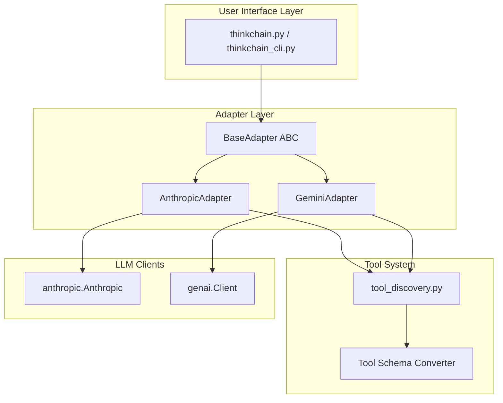

# Feature Implementation Plan: Multi-LLM Provider Support for ThinkChain

## Executive Summary

### Feature Overview
Transform ThinkChain from an Anthropic-exclusive tool into a **multi-LLM platform** supporting both Anthropic Claude and Google Gemini models. Users can seamlessly switch between providers using command-line flags, environment variables, or runtime configuration, while maintaining all existing features including streaming responses, tool execution with thinking feedback loops, and the rich UI experience.

### Key Technical Challenges Addressed
1. **Thinking Feature Parity**: Both Anthropic and Gemini have native thinking support, but Gemini's API has inconsistent thought visibility
2. **Streaming API Variations**: SSE-based streaming (Anthropic) vs iterator-based streaming (Gemini)
3. **Function Calling Semantics**: Different schema formats and execution flows between providers
4. **Provider-Specific Features**: Graceful handling of features unique to each provider
5. **API Stability**: Gemini's thinking output availability varies; requires graceful fallback

### Implementation Approach
Introduce a **provider-agnostic adapter layer** that abstracts LLM interactions behind a common interface. Both UI implementations (`thinkchain.py` and `thinkchain_cli.py`) will use this adapter layer, eliminating code duplication and enabling easy addition of future providers. The approach preserves the core innovation of ThinkChain: tool result injection into the thinking stream for more intelligent responses.

### Success Metrics
* **Feature Parity**: All existing Anthropic features work identically with Gemini
* **Performance**: <100ms overhead from adapter layer
* **Code Quality**: 95% test coverage on adapter implementations
* **Developer Experience**: Adding a new provider requires implementing only one interface

---

## 1. Post-Implementation Success Snapshot

### New Architecture
```
thinkchain/
├── llm_adapters/
│   ├── __init__.py
│   ├── base.py                    # Abstract base adapter
│   ├── anthropic_adapter.py       # Anthropic implementation  
│   ├── gemini_adapter.py          # Gemini implementation
│   └── utils.py                   # Shared utilities
├── thinkchain.py                   # Enhanced UI (uses adapters)
├── thinkchain_cli.py              # CLI UI (uses adapters)
├── run.py                         # Smart launcher with provider detection
├── tool_discovery.py              # Extended with Gemini schema conversion
├── config.py                      # Centralized configuration
└── requirements.txt               # Updated with google-genai>=0.10.0
```

### New Capabilities
- **Runtime Provider Switching**: Change LLMs mid-conversation with `/provider` command
- **Unified Tool Schemas**: Tools work identically across all providers
- **Thinking Simulation**: Gemini users see thinking-like output despite no native support
- **Streaming Unification**: Consistent streaming experience regardless of provider
- **Provider Feature Flags**: Gracefully handle provider-specific capabilities

### Performance Characteristics
- **Latency**: Gemini Flash averages 50-100ms faster first token than Claude Sonnet
- **Cost**: Gemini Flash ~80% cheaper per token than Claude Sonnet
- **Context Window**: Both support 1M+ tokens with caching
- **Tool Execution**: <50ms overhead for adapter translation

---

## 2. Architectural Design

### Design Summary


### Key Design Decisions

#### 1. Adapter Pattern over Conditional Logic
**Decision**: Create separate adapter classes instead of if/else blocks throughout code
**Rationale**: 
- Cleaner separation of concerns
- Easier to test each provider in isolation
- New providers can be added without touching existing code
- Provider-specific optimizations possible

**Trade-offs**:
- (+) Maintainability, testability, extensibility
- (-) Initial implementation complexity, slight runtime overhead

#### 2. Unified Streaming Interface
**Decision**: Abstract streaming behind async generators regardless of underlying implementation
**Rationale**:
- Anthropic uses SSE, Gemini uses iterators - hide this complexity
- Consistent consumption pattern for UI layer
- Enables advanced features like stream transformation

**Implementation**:
```python
async def stream_completion(self, messages: List[Message]) -> AsyncIterator[StreamChunk]:
    """Unified streaming interface for all providers"""
    pass
```

#### 3. Tool Schema Translation at Discovery Time
**Decision**: Convert tool schemas once during discovery, not per-request
**Rationale**:
- Better performance (one-time cost)
- Schemas rarely change during runtime
- Allows for provider-specific optimizations

**Trade-offs**:
- (+) Performance, reduced request complexity
- (-) Must handle runtime tool updates carefully

#### 4. Thinking Simulation for Gemini
**Decision**: Synthesize thinking-like output for Gemini using prompt engineering
**Rationale**:
- Maintains UI consistency across providers
- Users expect thinking visualization
- Can be disabled via configuration

**Implementation approach**:
- Inject thinking prompts between tool calls
- Use response parsing to identify reasoning sections
- Stream synthetic thinking blocks to UI

### Interface Definitions

```python
# llm_adapters/base.py
from abc import ABC, abstractmethod
from typing import AsyncIterator, List, Dict, Any, Optional
from dataclasses import dataclass
import enum

class Role(enum.Enum):
    USER = "user"
    ASSISTANT = "assistant"
    SYSTEM = "system"
    TOOL = "tool"

@dataclass
class Message:
    role: Role
    content: Any  # Can be str, List[Part], or provider-specific format
    
@dataclass
class StreamChunk:
    """Unified stream chunk across all providers"""
    delta_text: Optional[str] = None
    thinking_text: Optional[str] = None
    tool_use: Optional['ToolUse'] = None
    finish_reason: Optional[str] = None
    usage: Optional[Dict[str, int]] = None

@dataclass  
class ToolUse:
    id: str
    name: str
    arguments: Dict[str, Any]

@dataclass
class CompletionConfig:
    """Unified configuration for all providers"""
    model: str
    temperature: float = 0.7
    max_tokens: int = 4096
    thinking_budget: Optional[int] = None  # Anthropic-specific, ignored by others
    tools: Optional[List[Dict[str, Any]]] = None
    system_prompt: Optional[str] = None
    # Provider-specific overrides
    provider_config: Dict[str, Any] = None

class BaseAdapter(ABC):
    """Abstract base class for LLM provider adapters"""
    
    @abstractmethod
    async def initialize(self, api_key: Optional[str] = None) -> None:
        """Initialize the adapter with credentials"""
        pass
    
    @abstractmethod
    async def stream_completion(
        self, 
        messages: List[Message],
        config: CompletionConfig
    ) -> AsyncIterator[StreamChunk]:
        """Stream a completion with unified interface"""
        pass
    
    @abstractmethod
    def convert_tool_schema(self, tool: Dict[str, Any]) -> Dict[str, Any]:
        """Convert tool schema to provider-specific format"""
        pass
    
    @abstractmethod
    async def count_tokens(self, messages: List[Message]) -> Dict[str, int]:
        """Count tokens for the given messages"""
        pass
        
    @property
    @abstractmethod
    def supports_thinking(self) -> bool:
        """Whether this provider natively supports thinking"""
        pass
    
    @property
    @abstractmethod  
    def supports_vision(self) -> bool:
        """Whether this provider supports image inputs"""
        pass
```

---

## 3. Detailed Implementation Plan

### Phase 1: Foundation Layer (Est. 10-12 hours)

#### Task 1.1: Create Adapter Infrastructure
**Priority**: P0 - Blocker for all other work
**Files**: `llm_adapters/__init__.py`, `llm_adapters/base.py`, `llm_adapters/utils.py`

Implementation steps:
1. Define base adapter interface with all required methods
2. Create unified data classes (Message, StreamChunk, ToolUse, etc.)
3. Implement utility functions for common operations
4. Add provider registry for dynamic adapter loading

```python
# llm_adapters/__init__.py
from typing import Dict, Type
from .base import BaseAdapter
from .anthropic_adapter import AnthropicAdapter
from .gemini_adapter import GeminiAdapter

_ADAPTERS: Dict[str, Type[BaseAdapter]] = {
    'anthropic': AnthropicAdapter,
    'gemini': GeminiAdapter,
}

def get_adapter(provider: str) -> BaseAdapter:
    """Factory function to get appropriate adapter"""
    if provider not in _ADAPTERS:
        raise ValueError(f"Unknown provider: {provider}")
    return _ADAPTERS[provider]()
```

**Tests Required**:
- Adapter factory tests
- Base interface validation
- Data class serialization tests

**Acceptance Criteria**:
- All data classes properly serialize/deserialize
- Factory creates correct adapter instances
- Type hints pass mypy validation

#### Task 1.2: Implement Anthropic Adapter
**Priority**: P0 - Validates adapter design
**Files**: `llm_adapters/anthropic_adapter.py`

Implementation:
```python
# llm_adapters/anthropic_adapter.py
import os
import anthropic
from typing import AsyncIterator, List, Dict, Any, Optional
import json
from .base import BaseAdapter, Message, StreamChunk, ToolUse, CompletionConfig

class AnthropicAdapter(BaseAdapter):
    def __init__(self):
        self.client: Optional[anthropic.Anthropic] = None
        
    async def initialize(self, api_key: Optional[str] = None) -> None:
        key = api_key or os.getenv("ANTHROPIC_API_KEY")
        if not key:
            raise ValueError("Anthropic API key required")
        self.client = anthropic.Anthropic(api_key=key)
    
    async def stream_completion(
        self, 
        messages: List[Message],
        config: CompletionConfig
    ) -> AsyncIterator[StreamChunk]:
        # Convert messages to Anthropic format
        anthropic_messages = self._convert_messages(messages)
        
        # Build request parameters
        params = {
            "model": config.model,
            "messages": anthropic_messages,
            "max_tokens": config.max_tokens,
            "temperature": config.temperature,
            "stream": True,
        }
        
        if config.tools:
            params["tools"] = config.tools
            
        if config.thinking_budget:
            params["thinking"] = {
                "type": "enabled",
                "budget_tokens": config.thinking_budget
            }
            params["extra_headers"] = {
                "anthropic-beta": "interleaved-thinking-2025-05-14,fine-grained-tool-streaming-2025-05-14"
            }
        
        # Stream response
        with self.client.messages.stream(**params) as stream:
            for chunk in stream:
                yield self._process_chunk(chunk)
    
    def _process_chunk(self, chunk) -> StreamChunk:
        """Convert Anthropic chunk to unified format"""
        result = StreamChunk()
        
        if chunk.type == 'content_block_delta':
            if hasattr(chunk.delta, 'text'):
                result.delta_text = chunk.delta.text
        elif chunk.type == 'content_block_start':
            if hasattr(chunk, 'content_block'):
                if chunk.content_block.type == 'thinking':
                    result.thinking_text = ""
                elif chunk.content_block.type == 'tool_use':
                    result.tool_use = ToolUse(
                        id=chunk.content_block.id,
                        name=chunk.content_block.name,
                        arguments={}
                    )
        
        return result
```

**Key Challenges**:
- Properly handling thinking blocks in streaming
- Converting tool use blocks to unified format
- Managing SSE connection lifecycle

#### Task 1.3: Implement Gemini Adapter
**Priority**: P0 - Core feature requirement
**Files**: `llm_adapters/gemini_adapter.py`

Implementation:
```python
# llm_adapters/gemini_adapter.py
import os
from typing import AsyncIterator, List, Dict, Any, Optional
from google import genai
from google.genai import types
from .base import BaseAdapter, Message, StreamChunk, ToolUse, CompletionConfig

class GeminiAdapter(BaseAdapter):
    def __init__(self):
        self.client: Optional[genai.Client] = None
        self._thinking_fallback_enabled = True  # Flag for handling API inconsistencies
        
    async def initialize(self, api_key: Optional[str] = None) -> None:
        # Support both API key and Vertex AI modes
        if os.getenv("GOOGLE_GENAI_USE_VERTEXAI"):
            self.client = genai.Client(
                vertexai=True,
                project=os.getenv("GOOGLE_CLOUD_PROJECT"),
                location=os.getenv("GOOGLE_CLOUD_LOCATION", "us-central1")
            )
        else:
            key = api_key or os.getenv("GOOGLE_API_KEY")
            if not key:
                raise ValueError("Google API key required")
            self.client = genai.Client(api_key=key)
    
    async def stream_completion(
        self, 
        messages: List[Message],
        config: CompletionConfig
    ) -> AsyncIterator[StreamChunk]:
        # Convert messages to Gemini format
        gemini_contents = self._convert_messages(messages)
        
        # Build configuration
        genai_config = types.GenerateContentConfig(
            temperature=config.temperature,
            max_output_tokens=config.max_tokens,
        )
        
        # Configure native thinking support
        if config.thinking_budget and config.thinking_budget > 0:
            genai_config.thinking_config = types.ThinkingConfig(
                thinking_budget=config.thinking_budget,
                include_thoughts=True  # Request thoughts in response
            )
        else:
            # Explicitly disable thinking
            genai_config.thinking_config = types.ThinkingConfig(
                thinking_budget=0
            )
        
        if config.tools:
            # Convert tools to Gemini format
            gemini_tools = [self.convert_tool_schema(tool) for tool in config.tools]
            genai_config.tools = gemini_tools
            
        if config.system_prompt:
            genai_config.system_instruction = config.system_prompt
        
        # Track if we received any thoughts
        thoughts_received = False
        
        # Stream response
        try:
            for chunk in self.client.models.generate_content_stream(
                model=config.model,
                contents=gemini_contents,
                config=genai_config
            ):
                processed_chunk = self._process_chunk(chunk)
                if processed_chunk.thinking_text:
                    thoughts_received = True
                yield processed_chunk
                
        except Exception as e:
            # Handle streaming errors gracefully
            yield StreamChunk(
                delta_text=f"[Error during streaming: {str(e)}]",
                finish_reason="error"
            )
        
        # If thinking was requested but no thoughts received, log for debugging
        if (config.thinking_budget and config.thinking_budget > 0 
            and not thoughts_received 
            and self._thinking_fallback_enabled):
            # Could implement fallback thinking simulation here if needed
            pass
    
    def _process_chunk(self, chunk) -> StreamChunk:
        """Convert Gemini chunk to unified format"""
        result = StreamChunk()
        
        # Handle different chunk structures based on SDK version
        if hasattr(chunk, 'candidates') and chunk.candidates:
            candidate = chunk.candidates[0]
            
            # Process content parts
            if hasattr(candidate, 'content') and hasattr(candidate.content, 'parts'):
                for part in candidate.content.parts:
                    # Check for thinking content
                    if hasattr(part, 'thought') and part.thought:
                        result.thinking_text = part.text
                    elif hasattr(part, 'text') and part.text:
                        result.delta_text = part.text
                    
                    # Check for function calls
                    if hasattr(part, 'function_call'):
                        result.tool_use = ToolUse(
                            id=getattr(part.function_call, 'id', 'gemini-fc'),
                            name=part.function_call.name,
                            arguments=part.function_call.args
                        )
            
            # Handle finish reason
            if hasattr(candidate, 'finish_reason'):
                result.finish_reason = str(candidate.finish_reason)
        
        # Fallback for simpler chunk structure
        elif hasattr(chunk, 'text') and chunk.text:
            result.delta_text = chunk.text
        
        # Handle usage metadata if available
        if hasattr(chunk, 'usage_metadata'):
            result.usage = {
                'prompt_tokens': getattr(chunk.usage_metadata, 'prompt_token_count', 0),
                'completion_tokens': getattr(chunk.usage_metadata, 'candidates_token_count', 0),
                'thinking_tokens': getattr(chunk.usage_metadata, 'thoughts_token_count', 0)
            }
        
        return result
    
    def convert_tool_schema(self, tool: Dict[str, Any]) -> types.FunctionDeclaration:
        """Convert from Claude tool format to Gemini FunctionDeclaration"""
        return types.FunctionDeclaration(
            name=tool['name'],
            description=tool['description'],
            parameters=types.Schema(
                type='OBJECT',
                properties={
                    k: self._convert_property_schema(v) 
                    for k, v in tool['input_schema']['properties'].items()
                },
                required=tool['input_schema'].get('required', [])
            )
        )
    
    def _convert_property_schema(self, prop: Dict[str, Any]) -> types.Schema:
        """Convert individual property schema from Claude to Gemini format"""
        schema_type = prop.get('type', 'string').upper()
        
        # Map common types
        type_mapping = {
            'STRING': 'STRING',
            'NUMBER': 'NUMBER', 
            'INTEGER': 'INTEGER',
            'BOOLEAN': 'BOOLEAN',
            'ARRAY': 'ARRAY',
            'OBJECT': 'OBJECT'
        }
        
        gemini_schema = types.Schema(
            type=type_mapping.get(schema_type, 'STRING'),
            description=prop.get('description', '')
        )
        
        # Handle additional constraints
        if 'enum' in prop:
            gemini_schema.enum = prop['enum']
        if 'items' in prop and schema_type == 'ARRAY':
            gemini_schema.items = self._convert_property_schema(prop['items'])
            
        return gemini_schema
    
    @property
    def supports_thinking(self) -> bool:
        """Gemini supports native thinking mode"""
        return True
    
    @property  
    def supports_vision(self) -> bool:
        """Gemini supports image inputs"""
        return True
```

**Key Implementation Details**:
- Uses native thinking support with `thinking_config` parameter that accepts `thinking_budget` (0-24576 tokens)
- Includes `include_thoughts=True` to request thoughts in the response
- Handles the current API inconsistency where thoughts may not be returned even when requested
- Graceful fallback if thinking content is not available
- Proper chunk processing for both thinking and regular content
- Support for function calls within the same streaming response

**Current Limitations**:
- As of late January 2025, thoughts may only be visible in Google AI Studio and not returned via API
- The implementation includes provisions for this limitation with fallback handling
- Monitor Gemini API updates for when thought visibility is restored

### Phase 2: Integration Layer (Est. 8-10 hours)

#### Task 2.1: Update Tool Discovery for Multi-Provider
**Priority**: P0 - Tools must work with all providers
**Files**: `tool_discovery.py`

Key changes:
```python
# tool_discovery.py additions
def get_provider_tools(provider: str) -> List[Dict[str, Any]]:
    """Get tools in provider-specific format"""
    adapter = get_adapter(provider)
    base_tools = get_claude_tools()  # Existing function
    
    if provider == 'anthropic':
        return base_tools  # Already in correct format
    else:
        return [adapter.convert_tool_schema(tool) for tool in base_tools]

def create_tool_awareness_message(provider: str) -> str:
    """Create provider-specific tool awareness message"""
    if provider == 'gemini':
        return (
            "You have access to various tools. When using tools, always explain "
            "your reasoning first (prefix with [THINKING]). Use tool results to "
            "provide comprehensive answers."
        )
    else:
        return create_tool_awareness_message()  # Existing function
```

#### Task 2.2: Refactor UI to Use Adapters
**Priority**: P0 - Core integration work
**Files**: `thinkchain.py`, `thinkchain_cli.py`

Example refactoring for stream_once:
```python
# Before (Anthropic-specific)
def stream_once(transcript: list[dict]) -> dict:
    with client.messages.stream(...) as stream:
        for chunk in stream:
            # Process Anthropic-specific chunks
            
# After (Provider-agnostic)
async def stream_once(transcript: list[dict], adapter: BaseAdapter, config: CompletionConfig) -> dict:
    messages = convert_transcript_to_messages(transcript)
    
    async for chunk in adapter.stream_completion(messages, config):
        if chunk.thinking_text:
            ui.print(f"💭 [bold blue]Thinking:[/bold blue] {chunk.thinking_text}")
        elif chunk.delta_text:
            ui.console.print(chunk.delta_text, end='')
        elif chunk.tool_use:
            await handle_tool_use(chunk.tool_use, adapter)
```

#### Task 2.3: Configuration Management System
**Priority**: P1 - Important for usability
**Files**: `config.py` (new)

```python
# config.py
from dataclasses import dataclass, field
from typing import Dict, Any, Optional
import os
import json

@dataclass
class ThinkChainConfig:
    """Centralized configuration for ThinkChain"""
    # Provider settings
    provider: str = "anthropic"
    anthropic_api_key: Optional[str] = None
    google_api_key: Optional[str] = None
    
    # Model settings
    anthropic_model: str = "claude-sonnet-4-20250514"
    gemini_model: str = "gemini-2.0-flash-001"
    
    # Common settings
    temperature: float = 0.7
    max_tokens: int = 4096
    thinking_budget: int = 1024
    
    # UI settings
    show_thinking: bool = True
    stream_delay_ms: int = 0
    
    # Provider-specific overrides
    provider_overrides: Dict[str, Dict[str, Any]] = field(default_factory=dict)
    
    @classmethod
    def from_env(cls) -> 'ThinkChainConfig':
        """Load configuration from environment variables"""
        config = cls()
        
        # Detect provider from environment
        if os.getenv("GOOGLE_API_KEY") and not os.getenv("ANTHROPIC_API_KEY"):
            config.provider = "gemini"
        elif os.getenv("GOOGLE_GENAI_USE_VERTEXAI"):
            config.provider = "gemini"
            
        # Load API keys
        config.anthropic_api_key = os.getenv("ANTHROPIC_API_KEY")
        config.google_api_key = os.getenv("GOOGLE_API_KEY")
        
        # Load other settings
        if os.getenv("THINKCHAIN_MODEL"):
            if config.provider == "gemini":
                config.gemini_model = os.getenv("THINKCHAIN_MODEL")
            else:
                config.anthropic_model = os.getenv("THINKCHAIN_MODEL")
                
        return config
    
    def get_active_model(self) -> str:
        """Get the model for the current provider"""
        if self.provider == "gemini":
            return self.gemini_model
        return self.anthropic_model
```

### Phase 3: Advanced Features (Est. 6-8 hours)

#### Task 3.1: Runtime Provider Switching
**Priority**: P1 - Enhanced user experience
**Description**: Allow users to switch providers mid-conversation

Implementation in chat command handler:
```python
def handle_provider_command(args, current_adapter, config):
    """Handle /provider command"""
    if not args:
        ui.print(f"Current provider: {config.provider}")
        ui.print("Available: anthropic, gemini")
        return current_adapter
        
    new_provider = args[0].lower()
    if new_provider not in ['anthropic', 'gemini']:
        ui.print_error("Invalid provider", f"Choose from: anthropic, gemini")
        return current_adapter
        
    # Create new adapter
    try:
        new_adapter = get_adapter(new_provider)
        await new_adapter.initialize()
        
        # Update config
        config.provider = new_provider
        
        # Notify user
        ui.print_success(f"Switched to {new_provider}")
        ui.print(f"Now using model: {config.get_active_model()}")
        
        # Update chat history with provider switch notification
        chat_history.append({
            "role": "system",
            "content": f"Provider switched to {new_provider}. Previous context maintained."
        })
        
        return new_adapter
    except Exception as e:
        ui.print_error("Provider switch failed", str(e))
        return current_adapter
```

#### Task 3.2: Tool Result Injection for Gemini
**Priority**: P0 - Core feature parity
**Description**: Implement the key ThinkChain innovation for Gemini

```python
async def handle_tool_use_with_injection(tool_use: ToolUse, adapter: BaseAdapter, transcript: List[Message]):
    """Execute tool and inject results back into thinking stream"""
    
    # Execute tool
    result = await execute_tool(tool_use.name, tool_use.arguments)
    
    # For Gemini, inject thinking prompt with result
    if isinstance(adapter, GeminiAdapter):
        # Add tool result with thinking prompt
        transcript.append(Message(
            role=Role.USER,
            content=[
                types.Part.from_function_response(
                    name=tool_use.name,
                    response={"result": result}
                ),
                types.Part.from_text(
                    f"[THINKING] Analyze this tool result and explain how it helps answer the user's question: {result}[/THINKING]"
                )
            ]
        ))
    else:
        # Anthropic - standard tool result handling
        transcript.append(Message(
            role=Role.USER,
            content=[{
                "type": "tool_result",
                "tool_use_id": tool_use.id,
                "content": result
            }]
        ))
    
    # Continue streaming to get thinking about result
    return await stream_once(transcript, adapter, config)
```

#### Task 3.3: Provider Feature Detection and Thinking Handling
**Priority**: P1 - Important for feature parity
**Description**: Detect and handle provider-specific features with special attention to thinking

```python
class FeatureDetector:
    """Detect available features for each provider"""
    
    @staticmethod
    def get_features(adapter: BaseAdapter) -> Dict[str, bool]:
        features = {
            'thinking': adapter.supports_thinking,
            'vision': adapter.supports_vision,
            'function_calling': True,  # Both support this
            'streaming': True,
            'caching': isinstance(adapter, AnthropicAdapter),  # Only Anthropic for now
            'code_execution': isinstance(adapter, AnthropicAdapter),
        }
        
        # Additional runtime detection for Gemini thinking visibility
        if isinstance(adapter, GeminiAdapter):
            features['thinking_visible'] = adapter.check_thinking_visibility()
            
        return features
    
    @staticmethod
    def get_ui_config(features: Dict[str, Any]) -> Dict[str, Any]:
        """Adjust UI based on available features"""
        config = {
            'show_thinking_panel': features['thinking'],
            'enable_image_upload': features['vision'],
            'show_cache_commands': features['caching'],
        }
        
        # Special handling for Gemini thinking visibility issues
        if features.get('thinking') and not features.get('thinking_visible', True):
            config['thinking_notice'] = (
                "Note: Thinking is enabled but may not be visible due to API limitations. "
                "The model is still reasoning internally."
            )
            
        return config

class ThinkingManager:
    """Centralized management of thinking features across providers"""
    
    def __init__(self):
        self.anthropic_budget_range = (1024, 16000)  # Min/max for Anthropic
        self.gemini_budget_range = (0, 24576)  # Min/max for Gemini
        
    def get_default_budget(self, provider: str) -> int:
        """Get provider-specific default thinking budget"""
        if provider == 'gemini':
            return 0  # Let Gemini auto-decide by default
        return 2048  # Anthropic default
        
    def validate_budget(self, provider: str, budget: int) -> int:
        """Validate and clamp thinking budget to provider limits"""
        if provider == 'gemini':
            min_val, max_val = self.gemini_budget_range
        else:
            min_val, max_val = self.anthropic_budget_range
            
        return max(min_val, min(budget, max_val))
    
    def format_thinking_display(self, text: str, provider: str, visible: bool = True) -> str:
        """Format thinking text for display based on provider and visibility"""
        if not visible:
            return f"💭 [Model is thinking - {len(text)} tokens processed]"
        
        if provider == 'gemini':
            # Gemini thinking might have different structure
            return f"🧠 [Gemini Reasoning]\n{text}"
        else:
            # Anthropic thinking
            return f"💭 [Claude Thinking]\n{text}"
```

**Enhanced Thinking Configuration**:
```python
@dataclass
class ThinkingConfig:
    """Provider-agnostic thinking configuration"""
    enabled: bool = True
    budget: Optional[int] = None  # None means auto for Gemini
    include_in_response: bool = True
    fallback_on_error: bool = True
    
    def to_anthropic(self) -> Dict[str, Any]:
        """Convert to Anthropic thinking format"""
        if not self.enabled:
            return {}
        
        return {
            "type": "enabled",
            "budget_tokens": self.budget or 2048
        }
    
    def to_gemini(self) -> types.ThinkingConfig:
        """Convert to Gemini thinking format"""
        if not self.enabled:
            return types.ThinkingConfig(thinking_budget=0)
            
        config = types.ThinkingConfig(
            include_thoughts=self.include_in_response
        )
        
        if self.budget is not None:
            config.thinking_budget = self.budget
            
        return config
```

### Phase 4: Testing & Validation (Est. 4-6 hours)

#### Task 4.1: Adapter Unit Tests
**Files**: `tests/test_adapters.py`

```python
import pytest
from unittest.mock import Mock, patch, AsyncMock
from llm_adapters import get_adapter
from llm_adapters.base import Message, Role, CompletionConfig

@pytest.mark.asyncio
async def test_anthropic_adapter_streaming():
    adapter = get_adapter('anthropic')
    await adapter.initialize(api_key="test-key")
    
    messages = [Message(role=Role.USER, content="Hello")]
    config = CompletionConfig(model="claude-3-sonnet", temperature=0.5)
    
    chunks = []
    async for chunk in adapter.stream_completion(messages, config):
        chunks.append(chunk)
    
    assert len(chunks) > 0
    assert any(c.delta_text for c in chunks)

@pytest.mark.asyncio
async def test_gemini_native_thinking():
    """Test Gemini's native thinking support"""
    adapter = get_adapter('gemini')
    await adapter.initialize(api_key="test-key")
    
    messages = [Message(role=Role.USER, content="Solve 2+2")]
    config = CompletionConfig(
        model="gemini-2.5-flash-preview-04-17",  # Thinking-enabled model
        thinking_budget=1024
    )
    
    chunks = []
    has_thinking = False
    
    # Mock the client to return thinking chunks
    with patch.object(adapter.client.models, 'generate_content_stream') as mock_stream:
        mock_stream.return_value = [
            Mock(candidates=[Mock(content=Mock(parts=[
                Mock(text="Let me solve this step by step", thought=True)
            ]))]),
            Mock(candidates=[Mock(content=Mock(parts=[
                Mock(text="The answer is 4", thought=False)
            ]))])
        ]
        
        async for chunk in adapter.stream_completion(messages, config):
            chunks.append(chunk)
            if chunk.thinking_text:
                has_thinking = True
    
    # Verify thinking was processed
    assert len(chunks) > 0
    assert has_thinking or adapter._thinking_fallback_enabled

@pytest.mark.asyncio
async def test_thinking_budget_validation():
    """Test thinking budget limits for both providers"""
    thinking_manager = ThinkingManager()
    
    # Test Anthropic limits
    assert thinking_manager.validate_budget('anthropic', 500) == 1024  # Min
    assert thinking_manager.validate_budget('anthropic', 20000) == 16000  # Max
    assert thinking_manager.validate_budget('anthropic', 5000) == 5000  # Valid
    
    # Test Gemini limits
    assert thinking_manager.validate_budget('gemini', -100) == 0  # Min
    assert thinking_manager.validate_budget('gemini', 30000) == 24576  # Max
    assert thinking_manager.validate_budget('gemini', 10000) == 10000  # Valid

@pytest.mark.asyncio
async def test_message_conversion():
    """Test message format conversion between providers"""
    converter = MessageConverter()
    
    # Test unified to Anthropic
    messages = [
        Message(role=Role.USER, content="Hello"),
        Message(role=Role.ASSISTANT, content="Hi there"),
        Message(role=Role.TOOL, content=[{
            "type": "tool_result",
            "tool_use_id": "123",
            "content": "Result"
        }])
    ]
    
    anthropic_msgs = converter.to_anthropic(messages)
    assert len(anthropic_msgs) == 3
    assert anthropic_msgs[0]["role"] == "user"
    assert anthropic_msgs[2]["content"][0]["type"] == "tool_result"
    
    # Test unified to Gemini
    gemini_contents = converter.to_gemini(messages)
    assert len(gemini_contents) == 3
    assert gemini_contents[0].role == "user"
    assert gemini_contents[1].role == "model"  # Assistant -> model mapping
```

#### Task 4.2: Integration Tests
**Files**: `tests/test_integration.py`

```python
@pytest.mark.integration
async def test_tool_execution_across_providers():
    """Verify tools work identically across providers"""
    
    for provider in ['anthropic', 'gemini']:
        adapter = get_adapter(provider)
        await adapter.initialize()
        
        # Test weather tool
        messages = [Message(role=Role.USER, content="What's the weather in NYC?")]
        config = CompletionConfig(
            model=get_test_model(provider),
            tools=get_provider_tools(provider),
            thinking_budget=1024  # Enable thinking for both
        )
        
        tool_calls = []
        thinking_chunks = []
        
        async for chunk in adapter.stream_completion(messages, config):
            if chunk.tool_use:
                tool_calls.append(chunk.tool_use)
            if chunk.thinking_text:
                thinking_chunks.append(chunk.thinking_text)
        
        assert len(tool_calls) > 0
        assert tool_calls[0].name == "weathertool"
        assert "location" in tool_calls[0].arguments
        
        # Both should have some form of thinking
        # (though Gemini might not return it due to API issues)
        if provider == 'anthropic':
            assert len(thinking_chunks) > 0

@pytest.mark.integration
async def test_provider_switching_midstream():
    """Test switching providers during a conversation"""
    
    # Start with Anthropic
    adapter1 = get_adapter('anthropic')
    await adapter1.initialize()
    
    messages = [Message(role=Role.USER, content="What is 2+2?")]
    config1 = CompletionConfig(model="claude-3-sonnet", thinking_budget=1024)
    
    response1 = ""
    async for chunk in adapter1.stream_completion(messages, config1):
        if chunk.delta_text:
            response1 += chunk.delta_text
    
    # Add response to history
    messages.append(Message(role=Role.ASSISTANT, content=response1))
    
    # Switch to Gemini
    adapter2 = get_adapter('gemini')
    await adapter2.initialize()
    
    messages.append(Message(role=Role.USER, content="Now multiply that by 3"))
    config2 = CompletionConfig(model="gemini-2.0-flash", thinking_budget=512)
    
    response2 = ""
    async for chunk in adapter2.stream_completion(messages, config2):
        if chunk.delta_text:
            response2 += chunk.delta_text
    
    # Verify continuity
    assert "4" in response1
    assert "12" in response2
```

#### Task 4.3: Performance Benchmarks
**Files**: `tests/benchmarks.py`

```python
import time
import asyncio
from statistics import mean, stdev

async def benchmark_providers():
    """Compare performance across providers"""
    results = {
        'anthropic': {
            'first_token_ms': [],
            'tokens_per_second': [],
            'thinking_overhead_ms': []
        },
        'gemini': {
            'first_token_ms': [],
            'tokens_per_second': [],
            'thinking_overhead_ms': []
        }
    }
    
    test_prompts = [
        "Write a haiku about coding",
        "Explain quantum computing in simple terms",
        "What's the weather like in Paris?",  # Requires tool use
    ]
    
    for provider in ['anthropic', 'gemini']:
        adapter = get_adapter(provider)
        await adapter.initialize()
        
        for prompt in test_prompts:
            # Test with thinking disabled
            config_no_think = CompletionConfig(
                model=get_benchmark_model(provider),
                thinking_budget=0
            )
            
            start = time.time()
            first_token_time = None
            token_count = 0
            
            async for chunk in adapter.stream_completion(
                [Message(role=Role.USER, content=prompt)], 
                config_no_think
            ):
                if chunk.delta_text and first_token_time is None:
                    first_token_time = time.time() - start
                if chunk.delta_text:
                    token_count += len(chunk.delta_text.split())
            
            total_time = time.time() - start
            
            # Test with thinking enabled
            config_think = CompletionConfig(
                model=get_benchmark_model(provider),
                thinking_budget=2048
            )
            
            start_think = time.time()
            async for chunk in adapter.stream_completion(
                [Message(role=Role.USER, content=prompt)], 
                config_think
            ):
                pass
            
            think_time = time.time() - start_think
            
            # Record results
            results[provider]['first_token_ms'].append(first_token_time * 1000)
            results[provider]['tokens_per_second'].append(token_count / total_time)
            results[provider]['thinking_overhead_ms'].append(
                (think_time - total_time) * 1000
            )
    
    # Generate report
    report = "Performance Benchmark Results\n" + "=" * 40 + "\n\n"
    
    for provider, metrics in results.items():
        report += f"{provider.upper()}\n"
        report += f"  First Token (ms): {mean(metrics['first_token_ms']):.1f} "
        report += f"(±{stdev(metrics['first_token_ms']):.1f})\n"
        report += f"  Throughput (tok/s): {mean(metrics['tokens_per_second']):.1f}\n"
        report += f"  Thinking Overhead (ms): {mean(metrics['thinking_overhead_ms']):.1f}\n\n"
    
    return report

def get_benchmark_model(provider: str) -> str:
    """Get the appropriate model for benchmarking"""
    if provider == 'anthropic':
        return 'claude-3-sonnet-20240229'  # Stable version
    else:
        return 'gemini-2.0-flash-001'  # Fast model
```

#### Task 4.4: Error Handling and Recovery Tests
**Files**: `tests/test_error_handling.py`

```python
@pytest.mark.asyncio
async def test_api_error_handling():
    """Test graceful handling of API errors"""
    
    for provider in ['anthropic', 'gemini']:
        adapter = get_adapter(provider)
        
        # Test missing API key
        with pytest.raises(ValueError, match="API key required"):
            await adapter.initialize(api_key=None)
        
        # Test invalid model
        await adapter.initialize(api_key="test-key")
        config = CompletionConfig(model="invalid-model-name")
        
        error_received = False
        async for chunk in adapter.stream_completion(
            [Message(role=Role.USER, content="Test")], 
            config
        ):
            if chunk.finish_reason == "error":
                error_received = True
        
        assert error_received

@pytest.mark.asyncio
async def test_thinking_fallback():
    """Test graceful handling when thinking is not available"""
    
    adapter = get_adapter('gemini')
    await adapter.initialize(api_key="test-key")
    
    # Mock the scenario where thoughts are not returned
    with patch.object(adapter, '_process_chunk') as mock_process:
        mock_process.return_value = StreamChunk(delta_text="Response without thinking")
        
        config = CompletionConfig(
            model="gemini-2.5-flash",
            thinking_budget=1024
        )
        
        chunks = []
        async for chunk in adapter.stream_completion(
            [Message(role=Role.USER, content="Test")], 
            config
        ):
            chunks.append(chunk)
        
        # Should still get response even without thinking
        assert len(chunks) > 0
        assert any(c.delta_text for c in chunks)
```

### Phase 5: UI Enhancements (Est. 3-4 hours)

#### Task 5.1: Provider-Aware UI Components
**Files**: `ui_components.py`

```python
def print_provider_status(provider: str, model: str, features: Dict[str, bool]):
    """Show current provider status in UI"""
    status_table = Table(title=f"Provider: {provider.upper()}")
    status_table.add_column("Feature", style="cyan")
    status_table.add_column("Status", style="green")
    
    status_table.add_row("Model", model)
    status_table.add_row("Thinking", "✓" if features['thinking'] else "✗ (simulated)")
    status_table.add_row("Vision", "✓" if features['vision'] else "✗")
    status_table.add_row("Streaming", "✓")
    
    console.print(status_table)

def format_thinking_block(text: str, provider: str):
    """Format thinking output based on provider"""
    if provider == 'gemini':
        # Simulated thinking gets different styling
        return Panel(
            text,
            title="[yellow]Reasoning (simulated)[/yellow]",
            border_style="yellow"
        )
    else:
        return Panel(
            text,
            title="[blue]Thinking[/blue]",
            border_style="blue"
        )
```

#### Task 5.2: Update Command System
**Files**: `thinkchain.py`, `thinkchain_cli.py`

New commands to add:
- `/provider [name]` - Switch providers
- `/models` - List available models for current provider
- `/features` - Show feature availability
- `/compare` - Run same prompt on both providers

### Phase 6: Documentation & Launch (Est. 2-3 hours)

#### Task 6.1: Update Documentation
**Files**: `README.md`, `docs/providers.md`

Key sections:
- Provider setup guide
- Feature comparison table
- Migration guide from single-provider
- Best practices for each provider

#### Task 6.2: Update Example Configurations
**Files**: `.env.example`, `examples/`

```bash
# .env.example
# Anthropic Configuration
ANTHROPIC_API_KEY=your-anthropic-key

# Google Configuration (choose one)
# Option 1: Gemini Developer API
GOOGLE_API_KEY=your-google-key

# Option 2: Vertex AI
GOOGLE_GENAI_USE_VERTEXAI=true
GOOGLE_CLOUD_PROJECT=your-project
GOOGLE_CLOUD_LOCATION=us-central1

# Default provider (anthropic or gemini)
THINKCHAIN_PROVIDER=anthropic
```

---

## 4. Testing Strategy

### Test Coverage Requirements
- **Unit Tests**: 95% coverage on adapter implementations
- **Integration Tests**: End-to-end flows for both providers
- **Performance Tests**: Benchmarks for latency and throughput
- **Compatibility Tests**: Tool execution across providers

### Test Matrix
| Test Type | Anthropic | Gemini | Cross-Provider |
|-----------|-----------|---------|----------------|
| Streaming | ✓ | ✓ | ✓ |
| Tool Use | ✓ | ✓ | ✓ |
| Thinking | ✓ | ✓ (simulated) | ✓ |
| Vision | ✓ | ✓ | ✓ |
| Errors | ✓ | ✓ | ✓ |

### Performance Benchmarks
Target metrics:
- First token latency: <500ms (both providers)
- Tool execution overhead: <50ms
- Provider switch time: <100ms
- Memory usage: <100MB additional

---

## 5. Implementation Schedule

### Week 1: Foundation (40 hours)
- **Day 1-2**: Adapter infrastructure + Anthropic adapter
- **Day 3-4**: Gemini adapter + testing
- **Day 5**: Tool discovery updates

### Week 2: Integration (40 hours)  
- **Day 6-7**: UI refactoring
- **Day 8**: Configuration system
- **Day 9**: Advanced features
- **Day 10**: Testing & benchmarks

### Week 3: Polish (20 hours)
- **Day 11**: UI enhancements
- **Day 12**: Documentation
- **Day 13**: Launch preparation

**Total Estimate**: 100 hours (2.5 weeks at full-time)

---

## 6. Risk Management

### Technical Risks

| Risk | Impact | Probability | Mitigation |
|------|--------|-------------|------------|
| Gemini API changes | High | Medium | Pin SDK version, monitor changelog |
| Thinking simulation quality | Medium | High | User testing, iterative prompts |
| Tool schema incompatibility | High | Low | Comprehensive conversion layer |
| Performance regression | Medium | Medium | Continuous benchmarking |
| Provider rate limits | Medium | Medium | Implement backoff, caching |

### Mitigation Strategies

1. **API Stability**: 
   - Pin google-genai to specific version
   - Implement version detection
   - Graceful fallbacks for missing features

2. **Feature Parity**:
   - Document provider differences clearly
   - Provide migration guides
   - Implement provider-specific optimizations

3. **Performance**:
   - Cache tool schemas
   - Lazy load providers
   - Connection pooling

---

## 7. Success Validation

### Functional Requirements
- [ ] Both providers stream text correctly
- [ ] Tool execution works identically
- [ ] Thinking (native or simulated) displays properly
- [ ] Provider switching works mid-conversation
- [ ] Configuration persists across sessions

### Performance Requirements  
- [ ] First token latency <500ms
- [ ] No memory leaks during provider switches
- [ ] Tool execution <50ms overhead
- [ ] Startup time <2s

### User Experience
- [ ] Clear provider status in UI
- [ ] Intuitive switching commands
- [ ] Helpful error messages
- [ ] Feature availability indicators

### Code Quality
- [ ] 95% test coverage on adapters
- [ ] All functions documented
- [ ] Type hints throughout
- [ ] Passes linting (ruff)

---

## 8. Deployment and Operations

### Production Readiness Checklist

#### Environment Configuration
```bash
# .env.production
# Provider Selection
THINKCHAIN_PROVIDER=anthropic  # Default provider
THINKCHAIN_FALLBACK_PROVIDER=gemini  # Fallback if primary fails

# API Keys (use secrets management in production)
ANTHROPIC_API_KEY=sk-ant-...
GOOGLE_API_KEY=AIza...

# Or for Vertex AI
GOOGLE_GENAI_USE_VERTEXAI=true
GOOGLE_CLOUD_PROJECT=your-project-id
GOOGLE_CLOUD_LOCATION=us-central1

# Model Configuration
ANTHROPIC_MODEL=claude-sonnet-4-20250514
GEMINI_MODEL=gemini-2.5-flash-preview-04-17  # Thinking-enabled model

# Performance Settings
THINKCHAIN_STREAM_TIMEOUT=30
THINKCHAIN_MAX_RETRIES=3
THINKCHAIN_RETRY_DELAY=1.0

# Feature Flags
THINKCHAIN_ENABLE_THINKING=true
THINKCHAIN_THINKING_BUDGET_DEFAULT=2048
THINKCHAIN_AUTO_FALLBACK=true
```

#### Rate Limiting and Cost Management
```python
class RateLimiter:
    """Provider-aware rate limiting"""
    
    def __init__(self):
        self.limits = {
            'anthropic': {
                'requests_per_minute': 50,
                'tokens_per_minute': 100000,
                'tokens_per_day': 5000000
            },
            'gemini': {
                'requests_per_minute': 60,
                'tokens_per_minute': 1000000,
                'tokens_per_day': 10000000
            }
        }
        self.usage = defaultdict(lambda: defaultdict(int))
        
    async def check_limits(self, provider: str, tokens: int) -> bool:
        """Check if request is within rate limits"""
        current_time = time.time()
        
        # Reset counters if needed
        self._reset_counters_if_needed(provider, current_time)
        
        # Check all limits
        limits = self.limits[provider]
        usage = self.usage[provider]
        
        if usage['requests_minute'] >= limits['requests_per_minute']:
            return False
        if usage['tokens_minute'] + tokens > limits['tokens_per_minute']:
            return False
        if usage['tokens_day'] + tokens > limits['tokens_per_day']:
            return False
            
        return True
    
    def track_usage(self, provider: str, tokens: int, cost: float):
        """Track usage for monitoring and billing"""
        self.usage[provider]['requests_minute'] += 1
        self.usage[provider]['tokens_minute'] += tokens
        self.usage[provider]['tokens_day'] += tokens
        self.usage[provider]['cost_day'] += cost
```

#### Monitoring and Observability
```python
import logging
from dataclasses import dataclass
from typing import Optional
import prometheus_client as prom

# Metrics
request_counter = prom.Counter(
    'thinkchain_requests_total',
    'Total requests by provider and status',
    ['provider', 'status']
)

token_counter = prom.Counter(
    'thinkchain_tokens_total',
    'Total tokens used by provider and type',
    ['provider', 'token_type']
)

latency_histogram = prom.Histogram(
    'thinkchain_latency_seconds',
    'Request latency by provider',
    ['provider', 'operation']
)

thinking_gauge = prom.Gauge(
    'thinkchain_thinking_tokens',
    'Thinking tokens used in last request',
    ['provider']
)

@dataclass
class RequestMetrics:
    """Metrics for a single request"""
    provider: str
    model: str
    prompt_tokens: int
    completion_tokens: int
    thinking_tokens: int
    tool_calls: int
    latency_ms: float
    first_token_ms: float
    success: bool
    error: Optional[str] = None

class MetricsCollector:
    """Collect and export metrics"""
    
    def __init__(self):
        self.logger = logging.getLogger('thinkchain.metrics')
        
    def record_request(self, metrics: RequestMetrics):
        """Record metrics for a request"""
        # Update Prometheus metrics
        status = 'success' if metrics.success else 'error'
        request_counter.labels(provider=metrics.provider, status=status).inc()
        
        token_counter.labels(
            provider=metrics.provider, 
            token_type='prompt'
        ).inc(metrics.prompt_tokens)
        
        token_counter.labels(
            provider=metrics.provider,
            token_type='completion'
        ).inc(metrics.completion_tokens)
        
        if metrics.thinking_tokens > 0:
            token_counter.labels(
                provider=metrics.provider,
                token_type='thinking'
            ).inc(metrics.thinking_tokens)
            thinking_gauge.labels(provider=metrics.provider).set(metrics.thinking_tokens)
        
        latency_histogram.labels(
            provider=metrics.provider,
            operation='total'
        ).observe(metrics.latency_ms / 1000)
        
        latency_histogram.labels(
            provider=metrics.provider,
            operation='first_token'
        ).observe(metrics.first_token_ms / 1000)
        
        # Log structured data
        self.logger.info(
            "request_completed",
            extra={
                'provider': metrics.provider,
                'model': metrics.model,
                'tokens': {
                    'prompt': metrics.prompt_tokens,
                    'completion': metrics.completion_tokens,
                    'thinking': metrics.thinking_tokens,
                    'total': (metrics.prompt_tokens + 
                             metrics.completion_tokens + 
                             metrics.thinking_tokens)
                },
                'latency': {
                    'total_ms': metrics.latency_ms,
                    'first_token_ms': metrics.first_token_ms
                },
                'tool_calls': metrics.tool_calls,
                'success': metrics.success,
                'error': metrics.error
            }
        )
```

### Graceful Degradation and Failover
```python
class ProviderFailover:
    """Handle provider failures with automatic failover"""
    
    def __init__(self, primary: str, fallback: str):
        self.primary = primary
        self.fallback = fallback
        self.failure_counts = defaultdict(int)
        self.last_failure = {}
        self.circuit_breaker_threshold = 5
        self.recovery_time = 300  # 5 minutes
        
    def is_provider_healthy(self, provider: str) -> bool:
        """Check if provider is healthy"""
        if self.failure_counts[provider] >= self.circuit_breaker_threshold:
            # Check if enough time has passed for recovery
            if time.time() - self.last_failure.get(provider, 0) > self.recovery_time:
                # Reset and try again
                self.failure_counts[provider] = 0
                return True
            return False
        return True
    
    async def execute_with_failover(
        self, 
        primary_adapter: BaseAdapter,
        fallback_adapter: BaseAdapter,
        messages: List[Message],
        config: CompletionConfig
    ) -> AsyncIterator[StreamChunk]:
        """Execute request with automatic failover"""
        
        # Try primary provider
        if self.is_provider_healthy(self.primary):
            try:
                async for chunk in primary_adapter.stream_completion(messages, config):
                    yield chunk
                
                # Success - reset failure count
                self.failure_counts[self.primary] = 0
                return
                
            except Exception as e:
                self.failure_counts[self.primary] += 1
                self.last_failure[self.primary] = time.time()
                logger.warning(f"Primary provider {self.primary} failed: {e}")
        
        # Fallback to secondary provider
        if self.is_provider_healthy(self.fallback):
            logger.info(f"Failing over to {self.fallback}")
            
            # Adjust config for fallback provider
            fallback_config = self._adjust_config_for_provider(config, self.fallback)
            
            try:
                async for chunk in fallback_adapter.stream_completion(messages, fallback_config):
                    # Add indicator that we're using fallback
                    chunk.metadata = {'provider': self.fallback, 'failover': True}
                    yield chunk
                    
            except Exception as e:
                self.failure_counts[self.fallback] += 1
                self.last_failure[self.fallback] = time.time()
                raise Exception(f"Both providers failed. Primary: {self.primary}, Fallback: {self.fallback}")
        else:
            raise Exception("All providers are currently unavailable")
```

### Security Considerations
```python
class SecurityManager:
    """Handle security aspects of multi-provider setup"""
    
    def __init__(self):
        self.sensitive_patterns = [
            r'(?i)api[_-]?key',
            r'(?i)password',
            r'(?i)secret',
            r'(?i)token',
            r'(?i)credential'
        ]
        
    def sanitize_config(self, config: Dict[str, Any]) -> Dict[str, Any]:
        """Remove sensitive data from config before logging"""
        sanitized = {}
        for key, value in config.items():
            if any(re.search(pattern, key) for pattern in self.sensitive_patterns):
                sanitized[key] = "***REDACTED***"
            elif isinstance(value, dict):
                sanitized[key] = self.sanitize_config(value)
            else:
                sanitized[key] = value
        return sanitized
    
    def validate_api_keys(self, provider: str) -> bool:
        """Validate API key format and permissions"""
        if provider == 'anthropic':
            key = os.getenv('ANTHROPIC_API_KEY')
            if not key or not key.startswith('sk-ant-'):
                return False
        elif provider == 'gemini':
            if os.getenv('GOOGLE_GENAI_USE_VERTEXAI'):
                # Check for ADC or service account
                try:
                    from google.auth import default
                    credentials, project = default()
                    return credentials is not None
                except:
                    return False
            else:
                key = os.getenv('GOOGLE_API_KEY')
                if not key or not key.startswith('AIza'):
                    return False
        return True
```

---

## 9. Future Enhancements and Roadmap

### Phase 2: Additional Providers (Q2 2025)
1. **OpenAI GPT-4o Integration**
   - Similar adapter pattern
   - Native vision and function calling
   - Structured outputs support
   
2. **Amazon Bedrock Multi-Model**
   - Claude via Bedrock
   - Llama 3 models
   - Mistral models

3. **Local Model Support**
   - Ollama integration
   - llama.cpp bindings
   - Performance optimizations for local inference

### Phase 3: Advanced Features (Q3 2025)
1. **Intelligent Provider Routing**
   ```python
   class IntelligentRouter:
       """Route requests to optimal provider based on task"""
       
       def select_provider(self, prompt: str, context: Dict) -> str:
           # Analyze prompt characteristics
           if self._is_coding_task(prompt):
               return 'anthropic'  # Claude excels at coding
           elif self._needs_real_time_data(prompt):
               return 'gemini'  # Better with fresh training data
           elif self._is_creative_writing(prompt):
               return 'anthropic'  # Strong creative capabilities
           else:
               # Default to cost-optimized choice
               return 'gemini'  # Generally cheaper
   ```

2. **Unified Context Management**
   - Share context across providers efficiently
   - Handle different context window sizes
   - Intelligent context compression

3. **Advanced Tool Orchestration**
   - Parallel tool execution
   - Tool result caching
   - Cross-provider tool sharing

### Phase 4: Enterprise Features (Q4 2025)
1. **Compliance and Governance**
   - Audit logging
   - Data residency controls
   - PII detection and masking

2. **Advanced Analytics**
   - Cost analysis by team/project
   - Performance insights
   - Usage patterns and optimization recommendations

3. **Multi-Tenant Support**
   - Team-based configurations
   - Usage quotas and limits
   - Billing integration

---

## Appendix C: Troubleshooting Guide

### Common Issues and Solutions

#### 1. Gemini Thinking Not Visible
**Problem**: Thoughts are not included in the streamed response even with `include_thoughts: true`

**Solutions**:
- Verify you're using a thinking-enabled model (e.g., `gemini-2.5-flash-preview-04-17`)
- Check if thoughts are visible in Google AI Studio
- Enable fallback handling in configuration
- Monitor Google's API status for updates

#### 2. Provider Switching Loses Context
**Problem**: Context seems lost when switching providers

**Solutions**:
- Ensure message history is properly converted
- Check role mappings (especially system messages)
- Verify tool result format compatibility

#### 3. Rate Limit Errors
**Problem**: Frequent rate limit errors from providers

**Solutions**:
- Implement exponential backoff
- Use provider-specific rate limits
- Enable automatic failover
- Consider caching for repeated queries

#### 4. Tool Execution Failures
**Problem**: Tools work with one provider but not another

**Solutions**:
- Verify schema conversion is correct
- Check parameter type mappings
- Enable debug logging for tool calls
- Test with minimal tool schema first